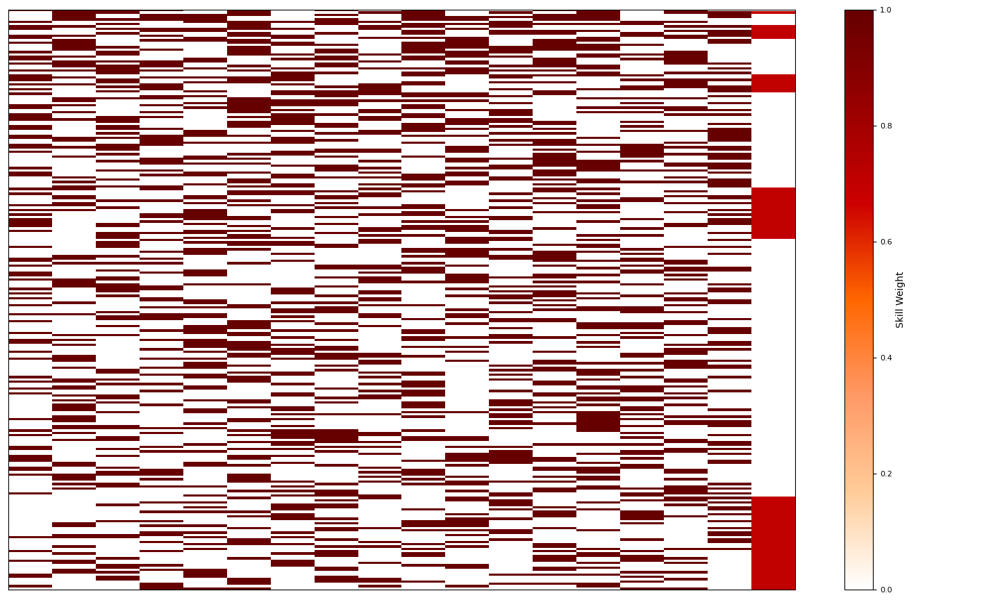
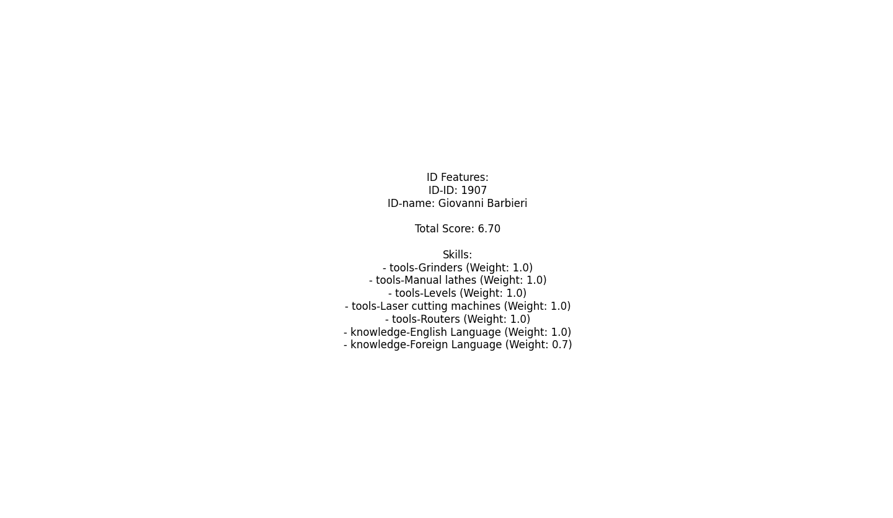
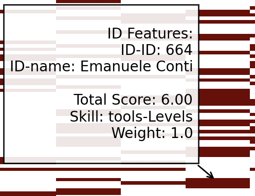

# Dynamic Analysis of Company Skills with PySpark and LLM


## 1. Project Title and Description

This project uses **PySpark** and the **OpenAI Language Model (GPT)** to analyze and filter a taxonomic dataset of company skills.  
By parsing user queries, the system dynamically identifies and weights the relevant skills, taking into account the importance assigned to each skill.  
The skills are represented in binary form (0 or 1), allowing you to quickly determine which users possess the required skills.

The analysis results are displayed through:
- Charts that show the number of eligible users for the selected skills.
- Interactive tables with "heatmaps" to instantly highlight the distribution of skills.

This tool is primarily aimed at human resource management (HR) and the strategic planning of skills within organizations.

---

## 2. Motivation

The project arises from the need to improve human resource management processes in companies, facilitating the identification of existing skills and the mapping of the skills required for specific roles or projects.  
Traditionally, skills analysis requires considerable manual effort and subjective evaluation.  
By leveraging PySpark for feature filtering and GPT's semantic intelligence, this project:
- Automates data analysis to reduce time and minimize errors inherent in manual procedures.
- Provides an objective and quantifiable view of company capabilities, essential for strategic human resource planning.

The code is organized in a Python notebook, allowing for easy data manipulation and visualization.

---

## 3. Installation and Configuration

### 3.1 General Prerequisites
- **OpenAI GPT API**: A valid API key is required to use the GPT model for semantic query analysis (not necessary in the **demo_Colab_PySpark_LLM.ipynb** demo).
- **Taxonomic CSV File**:  
  These `.csv` files structure a detailed list of company skills, organized according to a well-defined taxonomy. Each element consists of two parts: a "theme" and a "specific feature", separated by a dash. For example, in "tools-laser", "tools" represents the theme, while "laser" is the specific feature. The files also include a column that starts with "ID-" to uniquely identify users, along with other useful information such as roles, thus facilitating the association of skills to individuals. This organization allows easy navigation and interpretation of the dataset based on specific analysis needs.
  <figure>
    
    <br> <figcaption>Taxonomy</figcaption>
  </figure>

  _**Note:** The files in the repository contain synthetic data and names that do not belong to real people._

#### 3.2.1 Environment Setup

It is recommended to use a Python virtual environment to manage dependencies.  
Run the following commands to create and activate the environment:

```bash
python3 -m venv myenv
source myenv/bin/activate # On Windows use `myenv\Scripts\activate`
```

#### 3.2.2 Installing Dependencies
After activating the virtual environment, install the necessary dependencies by running:
```bash
python3 -m venv myenv
pip3 install -r requirements.txt
```

#### 3.2.4 Installation Verification (mplgraph.py)
To verify that everything has been set up correctly, once inside, modify the following lines:

 - Line 29: Enter your OpenAI key.

 - Line 40: Change the name and/or the path of the .csv file (it is recommended to place the CSV in the same directory for practical reasons).

Then, enter the virtual environment (using the command in subsection 3.2.1) and run from the terminal:

```bash
python3 mpl_graph.py
```

## 4. Main Features

- **Dataset Loading and Analysis**: The code uses PySpark to read and analyze the CSV file. In particular, it extracts "thematic blocks"—that is, sets of columns grouped based on a common prefix (separated by a dash) representing a category or area of skills (for example, "tech_skills-"). The system then counts the occurrences of each block to provide a structured overview of the various areas of expertise present in the dataset.

- **User Query Parsing with GPT**: Using the OpenAI API, the system interprets user requests to identify which blocks or features are relevant and assigns a weight (from 0 to 1) to each skill.

- **Data Filtering and Visualization**:
  - Dynamically selects columns based on the assigned weights.
  - Calculates a weighted score for each user and ranks them accordingly.
  - Displays the results using an interactive table and charts to facilitate data interpretation.

- **Interactive SVG Generation**:  
  The system creates an interactive SVG file that allows users to explore the data intuitively: by clicking on individual pixels, you can view detailed information about users, making the navigation and analysis of large datasets more immediate and effective.


## 5. Contributing
Areas for potential contribution include:

- **Code Improvements**: Enhancements to the parsing and weighting with GPT, refactoring the code for better readability and performance.
- **New Features**: Integration of additional data formats, support for new graphical visualizations, or development of a GUI for more intuitive interaction.
- **Benchmarking and Experiments**: Evaluating different LLM models besides OpenAI's to improve the accuracy of query parsing.

**To contribute:**

1. Fork the repository.
2. Create a new branch.
3. Make your changes and submit a pull request.


## 6. License

This project is released under the MIT License.  
For further details, see the `LICENSE` file included in the repository.


#### 7. Output Examples

Below are some visual examples of the results obtained:

- **Skills Heatmap**:
  **

- **Interactive Table**:
  **
    <figure>
      
      <br><figcaption>When a pixel is clicked</figcaption>
    </figure>

- **Skills Frequency Barplot**:
   **
 
- **Mplcursor Linear Segmented Colormap**
  **
     <figure>
      
      <br> <figcaption>When a pixel is clicked</figcaption> <br>
    </figure>

    
    <figure>
      
      <br> <figcaption>When the mouse hovers over a cell</figcaption><br>
    </figure>

