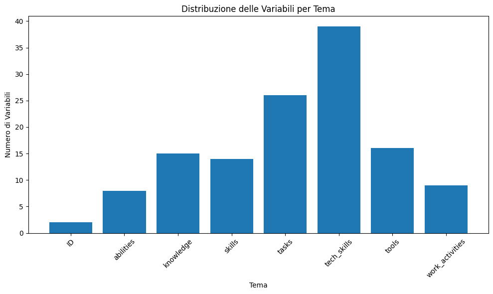
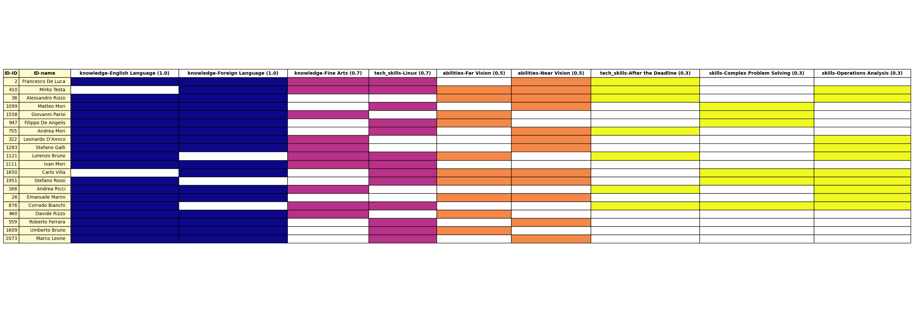
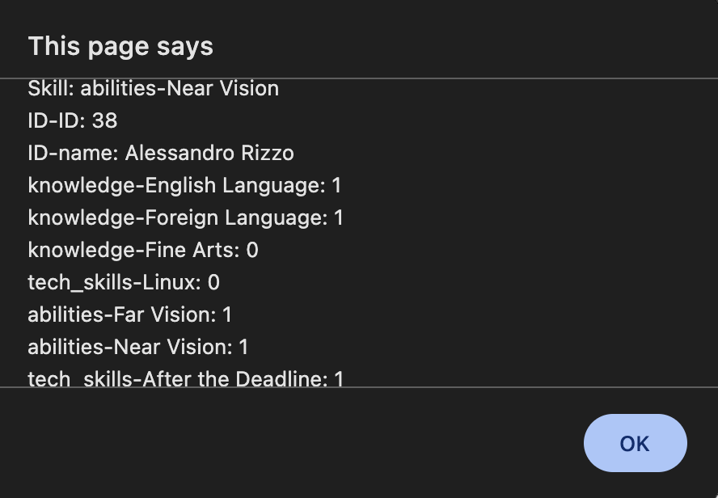
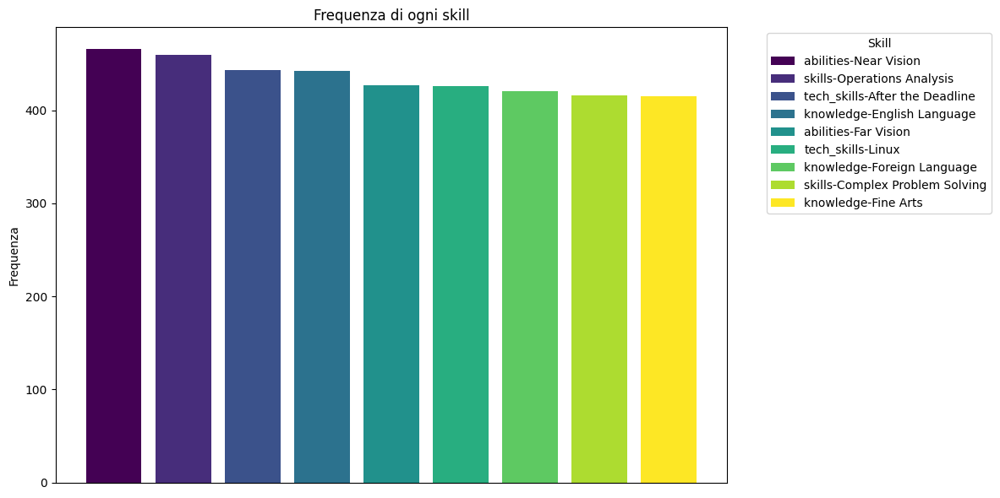

# Analisi Dinamica delle Competenze Aziendali con PySpark e LLM


## 1. Titolo e Descrizione del Progetto

Questo progetto utilizza **PySpark** e il **Language Model di OpenAI (GPT)** per analizzare e filtrare un dataset tassonomico di competenze aziendali.  
Attraverso il parsing delle query degli utenti, il sistema identifica e pesa le skill rilevanti in modo dinamico, considerando l'importanza attribuita a ciascuna competenza.  
Le competenze vengono rappresentate in forma binaria (0 o 1), permettendo di determinare rapidamente quali utenti possiedono le skill richieste.

I risultati dell'analisi sono visualizzati tramite:
- Grafici che mostrano il numero di utenti idonei per le competenze selezionate.
- Una tabella interattiva e una "heatmap" per evidenziare in modo immediato la distribuzione delle skill.  

Questo strumento si rivolge principalmente alla gestione delle risorse umane e alla pianificazione strategica delle competenze all'interno delle organizzazioni.

---

## 2. Motivazione

Il progetto nasce dalla necessità di migliorare i processi di gestione delle risorse umane nelle aziende, facilitando l'identificazione delle competenze esistenti e la mappatura delle skill richieste per specifici ruoli o progetti.  
Tradizionalmente, l'analisi delle competenze richiede un notevole impegno manuale e una valutazione soggettiva.  
Utilizzando PySpark per i filtraggi di feature e l'intelligenza semantica di GPT, questo progetto:
- Automatizza l'analisi dei dati per ridurre il tempo e gli errori tipici delle procedure manuali.
- Fornisce una visione oggettiva e quantificabile delle capacità aziendali, essenziale per una pianificazione strategica delle risorse umane.
  

Il codice è strutturato in un notebook Python, che consente una facile manipolazione e visualizzazione dei dati.

---

## 3. Installazione e Configurazione

### 3.1 Prerequisiti
- **Python con Tkinter**: Assicurati di avere Python 3.x installato con supporto Tkinter.
- **API di OpenAI GPT**: È necessaria una chiave API valida per utilizzare il modello GPT per l'analisi semantica della query.
- **File CSV Tassonomico**:  
  I file `.csv` contengono l'elenco strutturato di competenze aziendali e sono organizzati secondo una tassonomia predefinita. In particolare, i file condividono una colonna con prefisso "ID-" per identificare in maniera univoca gli utenti e altri informazioni che potrebbero aiutare (come i ruoli), distinguendo così le competenze dei singoli individui.
  <figure>
    
    <figcaption>Tassonomia</figcaption>
  </figure>
  

  _**Nota:** I file presenti nel repository contengono dati e nomi sintetici, non appartenenti a persone reali._


### 3.2 Configurazione dell'Ambiente

È consigliato utilizzare un ambiente virtuale Python per gestire le dipendenze.  
Esegui i seguenti comandi per creare e attivare l'ambiente:

```bash
python3 -m venv myenv
source myenv/bin/activate #Su Windows `myenv\Scripts\activate`

```

### 3.3 Installazione delle Dipendenze

**Prerequisito aggiuntivo: Installare Python con Tkinter**  
Prima di installare le dipendenze, assicurati di avere Python con il supporto Tkinter installato:

- **MacOS**:  
  ```bash
  brew install python-tk
  ```
- **Windows**:
Tkinter è generalmente incluso nelle installazioni standard di Python. Se per qualche motivo non fosse presente, verifica l'installazione di Python e, se necessario, reinstallalo includendo il supporto per Tkinter

Dopo aver attivato l'ambiente virtuale, installa le dipendenze necessarie eseguendo:

```bash
pip3 install -r requirements.txt
```
### 3.4 Verifica dell'Installazione
Per verificare che tutto sia stato configurato correttamente, esegui uno script di test che utilizza le librerie installate.
Questo ti aiuterà a confermare che l'ambiente è pronto per lo sviluppo e l'esecuzione del progetto.

## 4. Funzionalità Principali

- **Caricamento e Analisi del Dataset**: Il codice sfrutta PySpark per leggere e analizzare il file CSV. In particolare, estrae i "blocchi tematici", ovvero insiemi di colonne raggruppate in base a un prefisso comune (separato da un trattino) che rappresenta una categoria o ambito di competenze (ad esempio "tech_skills-"). Il sistema quindi conta le occorrenze di ciascun blocco per fornire una panoramica strutturata delle diverse aree di competenza presenti nel dataset.


- **Parsing delle Query Utente con GPT**: Utilizzando l'API di OpenAI, il sistema interpreta le richieste degli utenti per identificare quali blocchi o feature siano rilevanti e assegna un peso (da 0 a 1) a ciascuna competenza.

- **Filtraggio e Visualizzazione dei Dati**:
  - Seleziona dinamicamente le colonne in base ai pesi assegnati.
  - Calcola un punteggio pesato per ogni utente e li classifica in base ad essi.
  - Visualizza i risultati tramite una tabella interattiva e grafici per facilitare l'interpretazione dei dati.

- **Generazione di un SVG Interattivo**:  
  Il sistema crea un file SVG interattivo che permette agli utenti di esplorare i dati in maniera intuitiva: cliccando sui singoli pixel, è possibile visualizzare dettagli informativi relativi agli utenti, rendendo la navigazione e l’analisi di grandi moli di dati più immediata ed efficace.

## 5. Contribuire
Alcune aree di potenziale contributo includono:

- **Miglioramenti al Codice**: Miglioramento del parsing e ponderazione con GPT, refactoring del codice per migliorarne la leggibilità e le performance.
- **Nuove Funzionalità**: Integrazione di ulteriori formati di dati, supporto per nuove visualizzazioni grafiche o sviluppo di una GUI per un'interazione più intuitiva.
- **Benchmarking e Sperimentazioni**: Valutazione di differenti modelli LLM oltre OpenAI per migliorarne la precisione del parsing delle query.

**Per contribuire:**

1. Fork del repository.
2. Crea un nuovo branch.
3. Apporta le modifiche e invia una pull request.

---

## 6. Licenza

Questo progetto è rilasciato sotto la Licenza MIT.  
Per ulteriori dettagli, vedi il file `LICENSE` incluso nel repository.
---
#### 7. Esempi di Output

Di seguito vengono riportati alcuni esempi visivi dei risultati ottenuti:

- **Heatmap delle Competenze**:
  - **

- **Tabella Interattiva**:
  - **
  - <figure>
      
      <figcaption>In caso di click di un pixel</figcaption>
    </figure>

- **Barplot della Frequenza delle Skill**:
  - **


